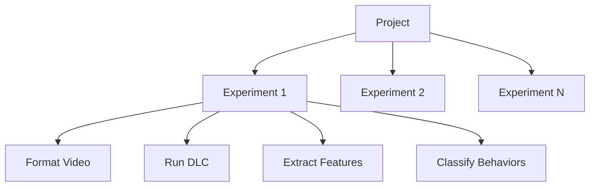
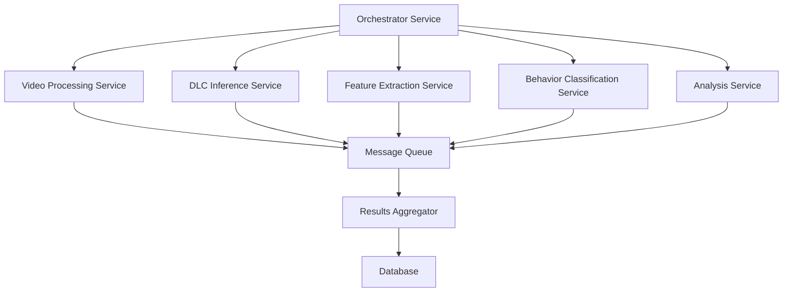

# Behavysis Architectural Recommendations

## Long-Term Scalability & Maintainability

### 1. Microservices Architecture for Pipeline Processing

#### Current Monolithic Structure


#### Recommended Microservices Approach


**Benefits:**
- Independent scaling of resource-intensive components (DLC, feature extraction)
- Fault isolation - one service failure doesn't crash entire pipeline
- Easier deployment and updates
- Better resource utilization

### 2. Data Management & Storage Architecture

#### Current Issues
- File-based storage with directory structure
- No data versioning
- Limited query capabilities
- No incremental processing

#### Recommended Data Architecture
```python
# Proposed data layer abstraction
class DataRepository:
    def store_experiment_data(self, experiment_id: str, data_type: DataType, data: pd.DataFrame) -> None
    def get_experiment_data(self, experiment_id: str, data_type: DataType, version: int = None) -> pd.DataFrame
    def list_experiments(self, filters: Dict[str, Any]) -> List[str]
    def get_data_versions(self, experiment_id: str, data_type: DataType) -> List[DataVersion]
```

**Storage Strategy:**
- **Metadata**: PostgreSQL with JSONB for flexible configuration storage
- **Time-series Data**: TimescaleDB for behavioral time-series
- **Large Arrays**: Zarr format for efficient chunked access
- **File Storage**: Object storage (S3-compatible) for videos and models

### 3. Configuration Management Enhancement

#### Current Strengths
- Good Pydantic-based configuration validation
- Clear separation of user/auto/ref configurations

#### Recommended Extensions
```python
class DynamicConfigManager:
    def __init__(self, base_config: ExperimentConfigs):
        self.base_config = base_config
        self.overrides = {}
    
    def apply_environment_overrides(self) -> None:
        """Apply environment-specific configuration overrides"""
        pass
    
    def validate_dependencies(self) -> List[ValidationError]:
        """Validate cross-configuration dependencies"""
        pass
    
    def generate_config_template(self, experiment_type: str) -> ExperimentConfigs:
        """Generate type-specific configuration templates"""
        pass
```

### 4. Error Handling & Resilience Patterns

#### Current Issues
- Inconsistent error handling
- Silent failures
- No retry mechanisms

#### Recommended Patterns
```python
# Circuit Breaker Pattern for External Dependencies
class DLCCircuitBreaker:
    def __init__(self, failure_threshold: int = 5, timeout: int = 60):
        self.failure_count = 0
        self.failure_threshold = failure_threshold
        self.timeout = timeout
        self.state = "CLOSED"  # CLOSED, OPEN, HALF_OPEN
    
    def execute(self, dlc_function: Callable, *args, **kwargs):
        if self.state == "OPEN":
            raise CircuitBreakerOpenError("DLC service unavailable")
        
        try:
            result = dlc_function(*args, **kwargs)
            self._on_success()
            return result
        except DLCError as e:
            self._on_failure()
            raise

# Retry Pattern with Exponential Backoff
@retry(
    retry=retry_if_exception_type(TransientError),
    stop=stop_after_attempt(3),
    wait=wait_exponential(multiplier=1, min=4, max=10)
)
def process_experiment_with_retry(experiment: Experiment) -> ProcessResult:
    return experiment.process()
```

### 5. Performance Optimization Architecture

#### Batch Processing Enhancement
```python
class BatchProcessor:
    def __init__(self, chunk_size: int = 1000, max_memory_mb: int = 1024):
        self.chunk_size = chunk_size
        self.max_memory_mb = max_memory_mb
    
    def process_large_dataset(self, data_source: DataSource, processor: Callable) -> Generator:
        """Process data in chunks to manage memory"""
        for chunk in data_source.read_chunks(self.chunk_size):
            if self._memory_usage_exceeded():
                self._clear_caches()
            yield processor(chunk)
    
    def parallel_process(self, experiments: List[Experiment], max_workers: int = None) -> List[ProcessResult]:
        """Intelligent parallel processing with resource awareness"""
        with ProcessPoolExecutor(max_workers=self._optimal_worker_count()) as executor:
            futures = [executor.submit(self._process_single, exp) for exp in experiments]
            return [future.result() for future in as_completed(futures)]
```

### 6. Plugin Architecture for Extensibility

#### Current Limitation
- Hard-coded processing functions
- Limited customization options

#### Recommended Plugin System
```python
class PluginManager:
    def __init__(self, plugin_dir: Path):
        self.plugin_dir = plugin_dir
        self.plugins: Dict[str, Type[ProcessingPlugin]] = {}
        self._discover_plugins()
    
    def register_plugin(self, name: str, plugin_class: Type[ProcessingPlugin]) -> None:
        self.plugins[name] = plugin_class
    
    def get_processor(self, name: str, config: Dict) -> ProcessingPlugin:
        return self.plugins[name](config)

@dataclass
class ProcessingPlugin(ABC):
    config: Dict
    
    @abstractmethod
    def process(self, data: pd.DataFrame) -> pd.DataFrame:
        pass
    
    @abstractmethod
    def validate_config(self) -> bool:
        pass

# Example plugin implementation
class CustomFeatureExtractor(ProcessingPlugin):
    def process(self, data: pd.DataFrame) -> pd.DataFrame:
        # Custom feature extraction logic
        return enhanced_data
    
    def validate_config(self) -> bool:
        return "required_param" in self.config
```

### 7. Monitoring & Observability Architecture

#### Current Gap
- Limited logging
- No performance metrics
- No health checks

#### Recommended Monitoring Stack
```python
class MetricsCollector:
    def __init__(self):
        self.metrics_registry = CollectorRegistry()
        self._setup_metrics()
    
    def _setup_metrics(self):
        self.processing_duration = Histogram(
            'processing_duration_seconds',
            'Time spent processing experiments',
            ['pipeline_stage'],
            registry=self.metrics_registry
        )
        
        self.error_counter = Counter(
            'processing_errors_total',
            'Total processing errors',
            ['error_type', 'pipeline_stage'],
            registry=self.metrics_registry
        )
    
    @contextmanager
    def track_processing(self, stage: str):
        start_time = time.time()
        try:
            yield
        except Exception as e:
            self.error_counter.labels(error_type=type(e).__name__, stage=stage).inc()
            raise
        finally:
            duration = time.time() - start_time
            self.processing_duration.labels(stage=stage).observe(duration)

# Usage
with metrics.track_processing("dlc_inference"):
    experiment.run_dlc()
```

### 8. Deployment & Infrastructure Architecture

#### Current State
- Local development focus
- Limited deployment options

#### Recommended Cloud-Native Architecture
```yaml
# docker-compose.yml for local development
version: '3.8'
services:
  orchestrator:
    build: ./orchestrator
    environment:
      - REDIS_URL=redis://redis:6379
    depends_on:
      - redis
      - dlc-service
  
  dlc-service:
    build: ./dlc-service
    deploy:
      resources:
        reservations:
          devices:
            - driver: nvidia
              count: all
              capabilities: [gpu]
  
  feature-extractor:
    build: ./feature-extractor
    scale: 3
  
  redis:
    image: redis:alpine
  
  postgres:
    image: postgres:13
    environment:
      POSTGRES_DB: behavysis
```

### 9. API & Integration Architecture

#### Current Limitation
- CLI-focused interface
- Limited programmatic access

#### Recommended API Layer
```python
# FastAPI-based REST API
from fastapi import FastAPI, BackgroundTasks
from pydantic import BaseModel

app = FastAPI(title="Behavysis API")

class ExperimentRequest(BaseModel):
    video_path: str
    config: Dict[str, Any]
    callback_url: Optional[str] = None

@app.post("/experiments")
async def create_experiment(
    request: ExperimentRequest,
    background_tasks: BackgroundTasks
) -> ExperimentResponse:
    experiment_id = str(uuid.uuid4())
    
    background_tasks.add_task(
        process_experiment_background,
        experiment_id,
        request.video_path,
        request.config,
        request.callback_url
    )
    
    return ExperimentResponse(
        experiment_id=experiment_id,
        status="PROCESSING",
        estimated_completion=estimate_completion_time(request.config)
    )

@app.get("/experiments/{experiment_id}")
async def get_experiment_status(experiment_id: str) -> ExperimentStatus:
    return get_experiment_status(experiment_id)

@app.get("/experiments/{experiment_id}/results")
async def get_experiment_results(experiment_id: str) -> ExperimentResults:
    return get_experiment_results(experiment_id)
```

### 10. Security & Compliance Architecture

#### Current Gaps
- No authentication/authorization
- No data encryption
- Limited audit logging

#### Recommended Security Measures
```python
class SecurityManager:
    def __init__(self):
        self.encryption_key = os.getenv('ENCRYPTION_KEY')
    
    def encrypt_sensitive_data(self, data: bytes) -> bytes:
        """Encrypt sensitive data at rest"""
        fernet = Fernet(self.encryption_key)
        return fernet.encrypt(data)
    
    def decrypt_sensitive_data(self, encrypted_data: bytes) -> bytes:
        """Decrypt sensitive data"""
        fernet = Fernet(self.encryption_key)
        return fernet.decrypt(encrypted_data)
    
    def audit_log(self, action: str, user: str, details: Dict) -> None:
        """Log security-relevant actions"""
        audit_logger.info({
            'timestamp': datetime.utcnow().isoformat(),
            'action': action,
            'user': user,
            'details': details
        })
```

## Implementation Priority

### Phase 1: Foundation (3-6 months)
1. Enhanced error handling and resilience patterns
2. Plugin architecture for processing functions
3. Basic monitoring and metrics
4. Improved configuration management

### Phase 2: Scalability (6-12 months)
1. Microservices decomposition
2. Advanced data management layer
3. API layer for programmatic access
4. Cloud-native deployment

### Phase 3: Enterprise (12-18 months)
1. Advanced security features
2. Multi-tenant architecture
3. Advanced monitoring and alerting
4. High-availability deployment

## Key Benefits of This Architecture

1. **Scalability**: Independent scaling of resource-intensive components
2. **Maintainability**: Clear separation of concerns and modular design
3. **Extensibility**: Plugin system for custom processing
4. **Reliability**: Comprehensive error handling and monitoring
5. **Performance**: Optimized data processing and resource utilization
6. **Security**: Enterprise-grade security and compliance features

This architectural evolution will transform Behavysis from a research tool into a production-ready platform suitable for both academic research and commercial applications.