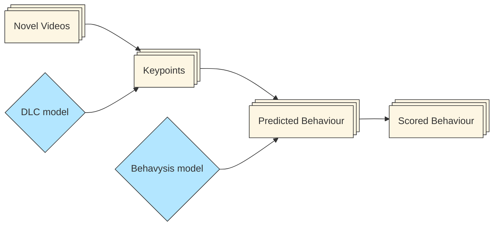
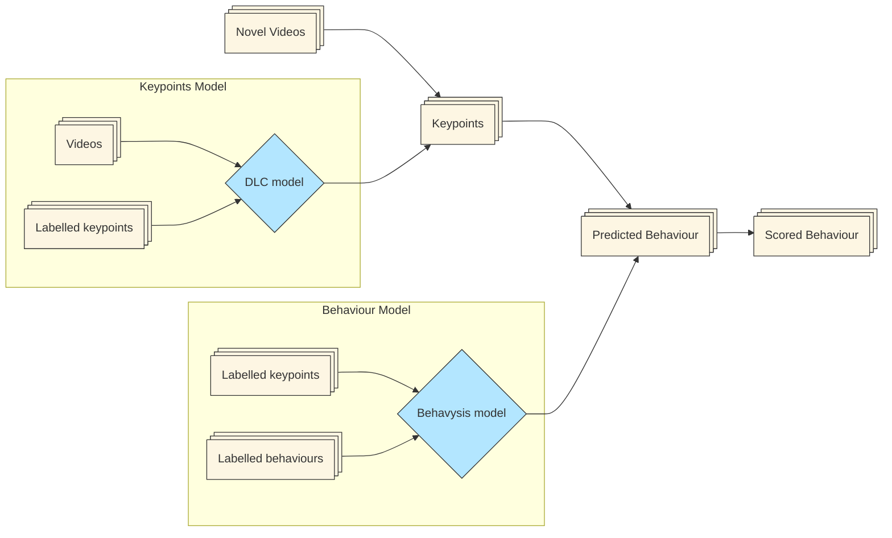
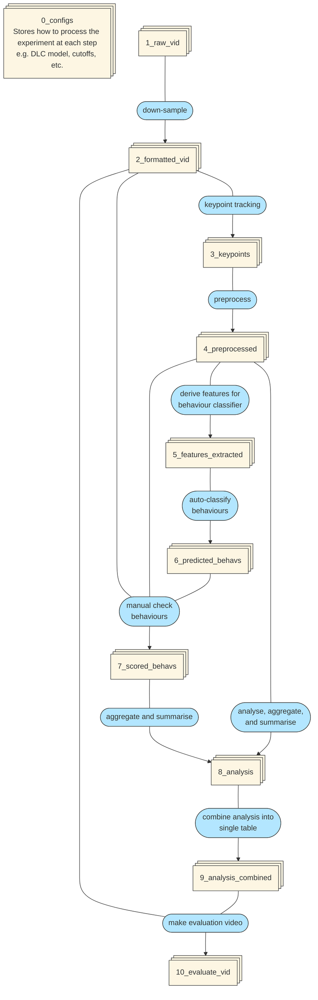

# Behavysis

This is the main package containing all core modules for the Behavysis behavioral analysis pipeline. Submodules include behavioral classification, dataframes for analysis, pipeline orchestration, processing steps, configuration models, utilities, and the viewer GUI.

## Structure

- `behav_classifier/`: Behavioral classification models and logic
- `df_classes/`: DataFrame-based analysis classes
- `pipeline/`: Project and experiment orchestration
- `processes/`: Individual processing steps
- `pydantic_models/`: Configuration and data validation models
- `scripts/`: Entry points and utility scripts
- `utils/`: General-purpose utilities
- `viewer/`: GUI and visualization components

See each submodule's README for more details.

