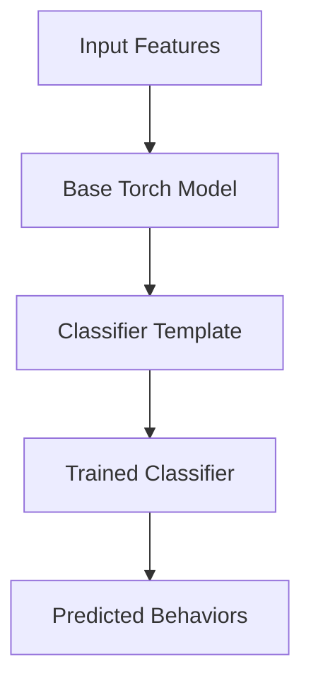

# Behavioral Classifier

This module contains logic and models for behavioral classification, including:

- Model templates (`clf_templates.py`)
- Base model classes (`base_torch_model.py`)
- Main classifier logic (`behav_classifier.py`)

## Usage

Import and use the classifier classes to train or predict behaviors. See `train_behav_model.py` in `scripts/` for example usage.

