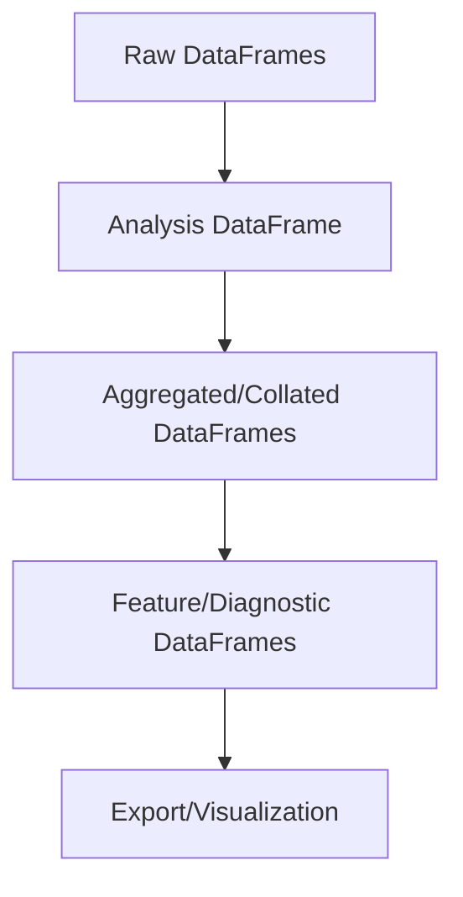

# DataFrame Classes

Contains DataFrame-based classes for various analysis and data manipulation tasks, such as:

- Aggregated analysis
- Collated analysis
- Behavioral classification DataFrames
- Diagnostics and features

## Usage

These classes are used throughout the pipeline to structure and process data. See individual files for class documentation and example usage.

## Data Quality and Structure

All DataFrame handler classes in this module are built on a shared mixin structure (see `df_mixin.py`) that enforces strict data quality and format standards at every stage:

- **Initialization**: DataFrames are validated and cleaned upon creation, ensuring required columns, index structure, and data types are correct.
- **Reading**: When loading from disk, data is checked for missing or malformed columns, correct index, and absence of NaN values where not allowed (e.g., keypoints data).
- **Writing**: Before saving, DataFrames are cleaned and validated again to guarantee output consistency and compatibility.

### Quality Checks

- **Column/Row Cleaning**: Unused or unexpected columns/rows are removed, and column names are standardized.
- **Column/Index/No-NaN Checks**: Each class enforces its own requirements (e.g., keypoints DataFrames must have no NaN values and specific multi-level column names).
- **Default IO Format**: All DataFrame handlers use Parquet as the default file format for efficient, robust, and consistent storage.

This design ensures that each DataFrame class is tailored to its use case, with strict guarantees on data integrity and format throughout the pipeline.

