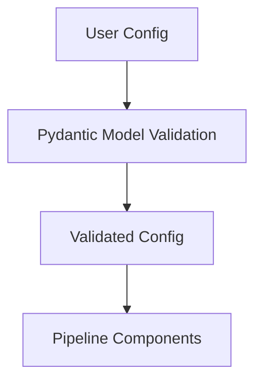

# Pydantic Models

Defines configuration and data validation models using Pydantic. This ensures type safety and robust configuration management throughout the pipeline.

- Behavioral classifier configs
- Experiment configs
- Bout definitions
- Process-specific configs

## Usage

Import the relevant Pydantic model to validate and manage configuration for each pipeline component.

