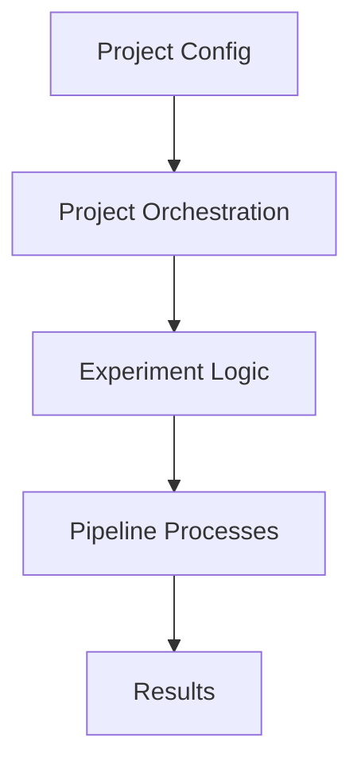

# Pipeline

Orchestrates high-level experiment and project workflows.

- `experiment.py`: Experiment-level logic
- `project.py`: Project-level orchestration

## Usage

Used to coordinate the full analysis pipeline, managing data flow between processes and modules.

