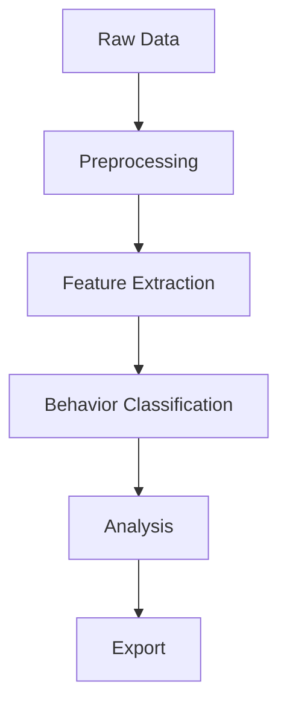

# Processes

This module contains the main processing steps of the Behavysis pipeline. Each script implements a specific stage, such as:

- `analyse.py`: Core analysis routines
- `extract_features.py`: Feature extraction from raw data
- `classify_behavs.py`: Behavioral classification
- `export.py`: Exporting results to various formats

## Usage

Each process can be run independently or as part of the full pipeline. See the main pipeline scripts in `pipeline/` for orchestration.

## Adding a New Process

1. Create a new script in this folder.
2. Implement the required logic, following the structure of existing processes.
3. Add tests in `test/test_processes/`.
4. Document the process in this README.

