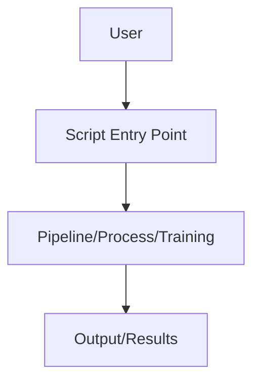

# Scripts

Contains entry points and utility scripts for project setup, training, and GUI operations.

- `init.py`: Initialization routines
- `make_dlc_builder.py`: DLC builder script
- `make_project.py`: Project creation
- `project_gui.py`: GUI entry point
- `train_behav_model.py`: Model training

## Usage

Run these scripts directly or use them as templates for custom workflows.

