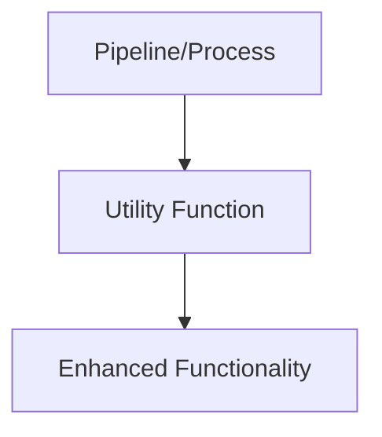

# Utilities

General-purpose utility functions used throughout the pipeline, including:

- I/O utilities
- Logging
- Multiprocessing helpers
- Miscellaneous helpers
- Template management

## Usage

Import utility functions as needed to avoid code duplication and maintain DRY principles.

