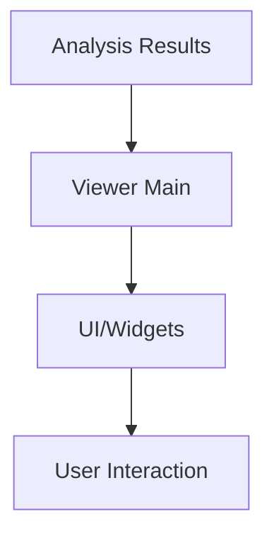

# Viewer

Contains the GUI and visualization components for Behavysis.

- `__main__.py`: Main entry point for the viewer
- `models/`, `resources/`, `ui/`, `widgets/`, `windows/`: Submodules for GUI structure and resources

## Usage

Run the viewer to interactively explore and visualize behavioral analysis results.

