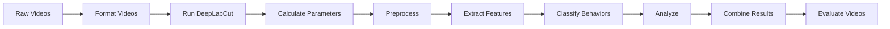

# How to Run a Complete Analysis

This guide walks you through a complete behavior analysis workflow, from raw videos to final results.

!!! tip "Prerequisites"
    - behavysis installed and working
    - Project folder created with videos ([Setup Tutorial](../tutorials/setup.md))
    - Configuration file prepared ([Config Tutorial](../tutorials/configs_json.md))
    - DeepLabCut model available

---

## Overview

This workflow processes videos through the complete pipeline:



Not all steps are required — you can customize based on your needs.

---

## Step 0: Project Setup

First, let's set up and verify the project:

```python
from behavysis import Project
from behavysis.processes import *

# Initialize project
proj_dir = "./my_project"
proj = Project(proj_dir)

# Import experiments (scans 1_raw_vid/ folder)
proj.import_experiments()
print(f"Found {len(proj.experiments)} experiments")
for exp in proj.experiments:
    print(f"  - {exp.name}")
```

Expected output:
```
Found 5 experiments:
  - mouse_A_day1
  - mouse_A_day2
  - mouse_B_day1
  - mouse_B_day2
  - mouse_B_day3
```

!!! success "Pro Tip"
    Check `my_project/0_diagnostics/import_experiments.csv` to see which files were found.

---

## Step 1: Update Configurations

Apply your default configuration to all experiments:

```python
# Update all experiment configs
proj.update_configs(
    default_configs_fp="./default_config.json",
    overwrite="user"  # Only update user-defined parameters
)
```

???+ note "What This Does"
    For each experiment, this creates/updates the JSON config file in `0_configs/` with your specified parameters.

---

## Step 2: Format Videos

Standardize raw videos (resolution, frame rate):

```python
# Format all videos
proj.format_vid(overwrite=True)
```

!!! warning "Time Required"
    This can take 1-5 minutes per video depending on file size. Progress is logged.

### What Happens

- Reads videos from `1_raw_vid/`
- Resizes to configured resolution (e.g., 960×540)
- Adjusts frame rate (e.g., 15 FPS)
- Saves to `2_formatted_vid/`
- Updates config with actual video metadata

### Verification

Check that formatted videos were created:

```python
import os
formatted_dir = os.path.join(proj_dir, "2_formatted_vid")
print(f"Formatted videos: {os.listdir(formatted_dir)}")
```

---

## Step 3: Run DeepLabCut

Run pose estimation to detect body parts:

```python
# Run DLC on all videos
# gputouse: GPU ID (None = use all available GPUs)
proj.run_dlc(gputouse=None, overwrite=True)
```

!!! warning "GPU Required"
    DeepLabCut requires a GPU for reasonable speed. CPU-only is extremely slow.

!!! tip "Multi-GPU"
    If you have multiple GPUs, behavysis automatically distributes videos across them.

### What Happens

- Processes formatted videos through DLC model
- Generates keypoints files in `3_keypoints/`
- Contains X, Y coordinates + confidence for each body part, every frame

### Output Files

```
3_keypoints/
├── mouse_A_day1.parquet  # Pose data
├── mouse_A_day2.parquet
└── ...
```

---

## Step 4: Calculate Parameters

Calculate experiment-specific parameters:

```python
# Calculate start frame, stop frame, and pixels-per-mm
proj.calculate_parameters((
    CalculateParams.start_frame,
    CalculateParams.stop_frame,
    CalculateParams.px_per_mm,
))

# Optional: Also calculate experiment duration
proj.calculate_parameters((
    CalculateParams.start_frame,
    CalculateParams.stop_frame,
    CalculateParams.exp_dur,
    CalculateParams.px_per_mm,
))
```

### What These Calculate

| Function | Calculates |
|----------|-----------|
| `start_frame` | First frame with detected animal |
| `stop_frame` | Last frame of experiment |
| `exp_dur` | Experiment duration |
| `px_per_mm` | Pixel-to-millimeter conversion |

### Review Auto-Calculated Values

```python
# Collate auto-configs across all experiments
proj.collate_auto_configs()
```

This creates a CSV file in `0_diagnostics/` showing all auto-calculated values. Check for anomalies before proceeding.

---

## Step 5: Preprocess

Clean the keypoint data:

```python
# Preprocess all experiments
proj.preprocess(
    funcs=(
        Preprocess.start_stop_trim,    # Trim to experiment duration
        Preprocess.interpolate,         # Fill missing data points
        Preprocess.refine_ids,          # Fix animal ID swaps (multi-animal)
    ),
    overwrite=True
)
```

### What Happens

- Reads from `3_keypoints/`
- Applies each preprocessing function in sequence
- Saves cleaned data to `4_preprocessed/`

!!! note "Customize for Your Data"
    Not using multi-animal? Remove `Preprocess.refine_ids`.

---

## Step 6: Extract Features (Optional)

If using behavior classifiers, extract features:

```python
# Extract features for ML classification
proj.extract_features(overwrite=True)
```

### What This Calculates

- Velocities and accelerations
- Distances between body parts
- Distances to arena features
- Bounding box metrics
- Angles and rotations

Output saved to `5_features_extracted/`.

---

## Step 7: Classify Behaviors (Optional)

If you have trained behavior classifiers:

```python
# Run behavior classifiers
proj.classify_behavs(overwrite=True)

# Export for behavysis_viewer
proj.export_behavs(overwrite=True)
```

!!! note "Skip This Step?"
    If you don't have trained classifiers, you can still run quantitative analyses (thigmotaxis, speed, etc.) without this step.

---

## Step 8: Run Analyses

Calculate quantitative behavioral measures:

```python
# Run analyses
proj.analyse(
    funcs=(
        Analyse.thigmotaxis,         # Wall-hugging
        Analyse.center_crossing,     # Center zone entries
        Analyse.in_roi,              # Time in regions of interest
        Analyse.speed,               # Movement speed
        Analyse.social_distance,     # Animal proximity (multi-animal)
        Analyse.freezing,            # Immobility detection
    )
)
```

### Analysis Outputs

Results are saved to `8_analysis/[analysis_type]/`:

```
8_analysis/
├── thigmotaxis/
│   ├── binned_30/           # Per-bin results (30 sec bins)
│   ├── binned_60/         # Per-bin results (60 sec bins)
│   └── summary/           # Overall statistics
├── speed/
│   └── ...
└── ...
```

Each file contains:
- **Binned data**: Time-series of measurements
- **Summary**: Overall statistics (mean, std, total, etc.)

---

## Step 9: Combine Results

Combine results across all experiments:

```python
# Combine all individual analyses
for exp in proj.experiments:
    exp.combine_analysis()

# Or collate across experiments
proj.collate_analysis()
```

### Output

Creates files in `8_analysis/[analysis_type]/` with `__ALL_` prefix:

- `__ALL_binned_60.csv` — Combined time-binned data
- `__ALL_summary.csv` — Combined summary statistics

---

## Step 10: Generate Evaluation Videos

Create annotated videos for visual validation:

```python
# Generate evaluation videos
proj.evaluate_vid(overwrite=True)
```

### What This Creates

Videos in `10_evaluate_vid/` with overlaid:
- Body part keypoints
- Predicted behaviors (if classifiers run)
- Analysis traces

---

## Step 11: Export to CSV

Data is stored in efficient binary formats (.parquet, .feather). Export to CSV for easy reading:

```python
# Export scored behaviors to CSV
proj.export2csv(
    src_dir="7_scored_behavs",
    dst_dir="./csv_exports",
    overwrite=True
)

# Export analysis results
proj.export2csv(
    src_dir="8_analysis",
    dst_dir="./csv_exports",
    overwrite=True
)
```

---

## Complete Workflow Script

Here's a complete script you can adapt:

```python
#!/usr/bin/env python
"""
Complete behavysis analysis workflow.
Run this after setting up your project and configuration.
"""

import os
from behavysis import Project
from behavysis.processes import *

# Configuration
PROJ_DIR = "./my_project"
DEFAULT_CONFIG = "./default_config.json"

# Initialize project
print("=== Initializing Project ===")
proj = Project(PROJ_DIR)
proj.import_experiments()
print(f"Found {len(proj.experiments)} experiments\n")

# Update configurations
print("=== Updating Configurations ===")
proj.update_configs(DEFAULT_CONFIG, overwrite="user")

# Format videos
print("\n=== Formatting Videos ===")
proj.format_vid(overwrite=True)

# Run DeepLabCut
print("\n=== Running DeepLabCut ===")
proj.run_dlc(gputouse=None, overwrite=True)

# Calculate parameters
print("\n=== Calculating Parameters ===")
proj.calculate_parameters((
    CalculateParams.start_frame,
    CalculateParams.stop_frame,
    CalculateParams.px_per_mm,
))

# Review auto-calculated parameters
print("\n=== Reviewing Auto-Parameters ===")
proj.collate_auto_configs()

# Preprocess
print("\n=== Preprocessing ===")
proj.preprocess(
    funcs=(
        Preprocess.start_stop_trim,
        Preprocess.interpolate,
    ),
    overwrite=True
)

# (Optional) Extract features and classify behaviors
# print("\n=== Extracting Features ===")
# proj.extract_features(overwrite=True)
# print("\n=== Classifying Behaviors ===")
# proj.classify_behavs(overwrite=True)
# proj.export_behavs(overwrite=True)

# Run analyses
print("\n=== Running Analyses ===")
proj.analyse((
    Analyse.thigmotaxis,
    Analyse.speed,
    Analyse.center_crossing,
))

# Combine results
print("\n=== Combining Results ===")
proj.collate_analysis()

# Generate evaluation videos
print("\n=== Generating Evaluation Videos ===")
proj.evaluate_vid(overwrite=True)

# Export to CSV
print("\n=== Exporting to CSV ===")
os.makedirs("./csv_exports", exist_ok=True)
proj.export2csv(
    src_dir="8_analysis",
    dst_dir="./csv_exports",
    overwrite=True
)

print("\n=== Analysis Complete ===")
print(f"Results in: {os.path.join(PROJ_DIR, '8_analysis')}")
print(f"CSV exports in: ./csv_exports")
```

---

## Resuming Interrupted Work

If processing is interrupted, behavysis can skip completed steps:

```python
# Only process missing videos
proj.format_vid(overwrite=False)

# Or force reprocess specific steps
proj.preprocess(funcs=(Preprocess.interpolate,), overwrite=True)
```

---

## Troubleshooting

### "No experiments found"

Check that videos are in `1_raw_vid/` with `.mp4` extension.

### "DLC model not found"

Verify `user.run_dlc.model_fp` in your config points to the correct `config.yaml`.

### Missing analysis outputs

Check diagnostics files in `0_diagnostics/` for error messages.

---

## Next Steps

- Train [behavior classifiers](train.md) for automated behavior detection
- Learn about [diagnostics](../tutorials/diagnostics_messages.md)
- Explore the [API Reference](../reference/behavysis.md)
