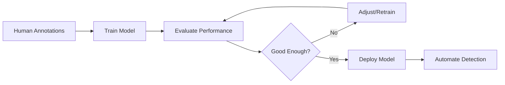

# How to Train a Behavior Classifier

This guide explains how to train machine learning models to automatically detect behaviors from pose data. You'll learn to:

1. Create training data from human annotations
2. Train and evaluate classifiers
3. Select the best model for your behavior

!!! tip "Prerequisites"
    - behavysis installed with behavysis-viewer support
    - Existing project with preprocessed pose data
    - Videos with behaviors you want to detect

---

## Overview

Behavior classification works in three stages:



### What You'll Need

| Item | Description |
|------|-------------|
| **Annotated Videos** | Human-scored behaviors (using behavysis-viewer or BORIS) |
| **Feature Data** | Preprocessed pose data with extracted features |
| **Compute** | CPU sufficient; GPU speeds up training |

---

## Step 1: Prepare Training Data

### Option A: Using behavysis-viewer (Recommended)

The behavysis-viewer GUI allows semi-automated annotation:

```bash
# Launch viewer
behavysis-viewer ./my_project
```

1. Load your experiment
2. Review predicted behaviors (if any)
3. Correct false positives/negatives
4. Save scored behaviors to `7_scored_behavs/`

### Option B: Import from BORIS

If you have existing annotations from [BORIS](https://www.boris.unito.it/):

```python
import os
from behavysis.mixins.behav_mixin import BehavMixin
from behavysis import Project

# Configuration
proj_dir = "./my_project"
behavs_ls = ["potential huddling", "huddling"]

# Import BORIS annotations
boris_dir = os.path.join(proj_dir, "boris_imports")
configs_dir = os.path.join(proj_dir, "0_configs")
dst_dir = os.path.join(proj_dir, "7_scored_behavs")

# Convert each BORIS file
for filename in os.listdir(boris_dir):
    if filename.endswith(".tsv"):
        name = os.path.splitext(filename)[0]
        
        boris_fp = os.path.join(boris_dir, filename)
        configs_fp = os.path.join(configs_dir, f"{name}.json")
        dst_fp = os.path.join(dst_dir, f"{name}.parquet")
        
        # Convert BORIS to behavysis format
        df = BehavMixin.import_boris_tsv(boris_fp, configs_fp, behavs_ls)
        df.to_parquet(dst_fp)
        print(f"✓ Imported: {name}")
```

!!! note "BORIS Format"
    BORIS exports should be in TSV format with `Behavior` and `Status` (START/STOP) columns.

### Option C: Inherit from Previous Project

If you have a scored behavysis project:

```python
from behavysis import Project

# Load source project
src_proj = Project("./previous_project")
src_proj.import_experiments()

# Copy scored behaviors to new project
import shutil
import os

src_dir = os.path.join(src_proj.root_dir, "7_scored_behavs")
dst_dir = os.path.join("./new_project", "7_scored_behavs")
os.makedirs(dst_dir, exist_ok=True)

for filename in os.listdir(src_dir):
    shutil.copy2(os.path.join(src_dir, filename), dst_dir)
```

---

## Step 2: Create Behavior Classifier Objects

```python
from behavysis import BehavClassifier

# Option A: Create from scored behaviors directory
behav_models = BehavClassifier.create_from_project_dir("./my_project")

# Option B: Create specific classifiers
behav_names = ["fight", "aggression", "huddling"]
behav_models_dir = "./my_project/behav_models"

for behav in behav_names:
    BehavClassifier.create_new_model(behav_models_dir, behav)
    print(f"✓ Created classifier: {behav}")

# Load a specific classifier
model = BehavClassifier(
    proj_dir="./my_project",
    behav_name="fight"
)
```

---

## Step 3: Explore Available Classifiers

behavysis provides several classifier templates:

```python
from behavysis.behav_classifier.clf_models.clf_templates import ClfTemplates

# List available templates
templates = [
    ClfTemplates.rf_1,      # Random Forest
    ClfTemplates.svm_1,     # Support Vector Machine
    ClfTemplates.dnn_1,     # Deep Neural Network
    ClfTemplates.cnn_1,     # Convolutional Neural Network
]

for template in templates:
    print(f"- {template.name}: {template.description}")
```

### Template Descriptions

| Template | Type | Best For |
|----------|------|----------|
| `rf_1` | Random Forest | General-purpose, explainable |
| `svm_1` | SVM | Smaller datasets |
| `dnn_1` | Deep Neural Net | Complex patterns, large datasets |
| `cnn_1` | Convolutional Net | Temporal patterns |

---

## Step 4: Train and Evaluate

### Quick Compare (Try All)

```python
# Train and evaluate all classifier types
model.clf_eval_compare_all()
```

This trains each template and generates comparison plots in the model's evaluation folder.

### Manual Training

```python
from behavysis.behav_classifier.clf_models.clf_templates import ClfTemplates

# Load model
model = BehavClassifier(
    proj_dir="./my_project",
    behav_name="fight"
)

# Select classifier architecture
model.pipeline_build(ClfTemplates.dnn_1)

# Train (with train/validation split)
# Features loaded from 5_features_extracted/
# Labels loaded from 7_scored_behavs/
model.train()

# Evaluate on held-out test set
model.evaluate()

# Save trained model
model.save()
```

---

## Step 5: Evaluate Performance

### Review Metrics

After training, check the evaluation outputs:

```python
# Get evaluation dataframe
eval_df = model.get_eval_df()
print(eval_df)
```

Key metrics to check:

| Metric | Good Value | Description |
|--------|------------|-------------|
| Accuracy | > 0.85 | Overall correct predictions |
| Precision | > 0.80 | Of predicted positives, how many are correct |
| Recall | > 0.80 | Of actual positives, how many were found |
| F1 Score | > 0.80 | Harmonic mean of precision and recall |

### Visual Evaluation

Evaluation plots are saved to the model directory:

```
my_project/behav_models/
└── fight/
    ├── classifiers/
    │   └── DNN1/
    │       └── evaluation/
    │           ├── confusion_matrix.png
    │           ├── precision_recall_curve.png
    │           └── roc_curve.png
    └── configs.json
```

!!! warning "Imbalanced Data"
    Behaviors are often rare. High accuracy can be misleading if 95% of frames are non-behavior. Focus on **precision**, **recall**, and **F1** instead.

---

## Step 6: Select Best Model

After comparing models, select the best performing one:

```python
# Compare all trained models
import pandas as pd

# Get evaluation scores for each classifier
scores = []
for clf_name in model.get_trained_clfs():
    metrics = model.get_eval_metrics(clf_name)
    scores.append({
        'classifier': clf_name,
        'accuracy': metrics['accuracy'],
        'f1': metrics['f1'],
        'precision': metrics['precision'],
        'recall': metrics['recall'],
    })

scores_df = pd.DataFrame(scores)
print(scores_df.sort_values('f1', ascending=False))

# Select best model (highest F1 score)
best_clf = scores_df.loc[scores_df['f1'].idxmax(), 'classifier']
model.clf = best_clf  # Set as active classifier
model.save()
print(f"✓ Selected: {best_clf}")
```

### Selection Criteria

Choose based on your needs:

| Priority | Choose |
|----------|--------|
| Avoid false alarms (conservative) | High precision |
| Catch all instances (sensitive) | High recall |
| Balance both | High F1 |
| Interpretability | Random Forest |
| Raw performance | Deep Learning |

---

## Step 7: Use Trained Model

Once trained, use the model in your project:

### Add to Project Config

Edit your `default_config.json` to include the classifier:

```json
{
  "user": {
    "classify_behaviours": [
      {
        "model_fp": "/absolute/path/to/my_project/behav_models/fight/configs.json",
        "pcutoff": null,
        "min_window_frames": 2,
        "user_behavs": ["fight"]
      }
    ]
  }
}
```

### Run Classification in Pipeline

```python
# Update configs with new classifier
proj.update_configs("./default_config.json", overwrite="user")

# Run classification
proj.classify_behavs(overwrite=True)

# Export for viewer/verification
proj.export_behavs(overwrite=True)
```

---

## Complete Training Script

```python
#!/usr/bin/env python
"""Train behavior classifiers from scored data."""

from behavysis import BehavClassifier, Project
from behavysis.behav_classifier.clf_models.clf_templates import ClfTemplates

# Configuration
PROJ_DIR = "./my_project"
BEHAVS = ["fight", "aggression", "huddling"]

# Step 1: Create classifier objects
print("=== Creating Classifier Objects ===")
for behav in BEHAVS:
    BehavClassifier.create_new_model(
        os.path.join(PROJ_DIR, "behav_models"),
        behav
    )

# Step 2: Train each behavior
print("\n=== Training Classifiers ===")
for behav in BEHAVS:
    print(f"\nTraining: {behav}")
    
    # Load model
    model = BehavClassifier(PROJ_DIR, behav)
    
    # Compare all classifier types
    model.clf_eval_compare_all()
    
    # Select best (usually needs manual review)
    # After reviewing plots in model_dir/classifiers/<name>/evaluation/
    # model.pipeline_build(ClfTemplates.dnn_1)
    # model.train()
    # model.save()

print("\n=== Training Complete ===")
print("Review evaluation plots and select best models manually.")
```

---

## Improving Model Performance

### If Precision is Low (Too Many False Positives)

- Increase `min_window_frames` threshold
- Add more negative (non-behavior) training examples
- Try a more conservative model

### If Recall is Low (Missing Behaviors)

- Add more positive examples
- Lower `min_window_frames`
- Try a more sensitive model

### General Tips

| Approach | When to Use |
|----------|-------------|
| More training data | Always helps |
| Balance classes | If behavior is rare (<10% of frames) |
| Feature engineering | If behaviors have clear patterns |
| Ensemble methods | Combine multiple classifiers |

---

## Troubleshooting

### "No scored behaviors found"

Ensure scored files are in `7_scored_behavs/` with the same base names as your experiments.

### "Not enough training data"

You need at least ~100 examples of each class. More is better.

### Poor performance on new videos

Your training data may not represent the range of conditions in new videos. Ensure training covers:
- Different mice/individuals
- Different lighting conditions
- Different arena setups

---

## Next Steps

- Use trained models in your [Analysis Pipeline](analysis.md)
- Review predictions with [behavysis-viewer](../reference/behavysis.md)
- Explore [API Reference](../reference/behav_classifier.md) for advanced usage
