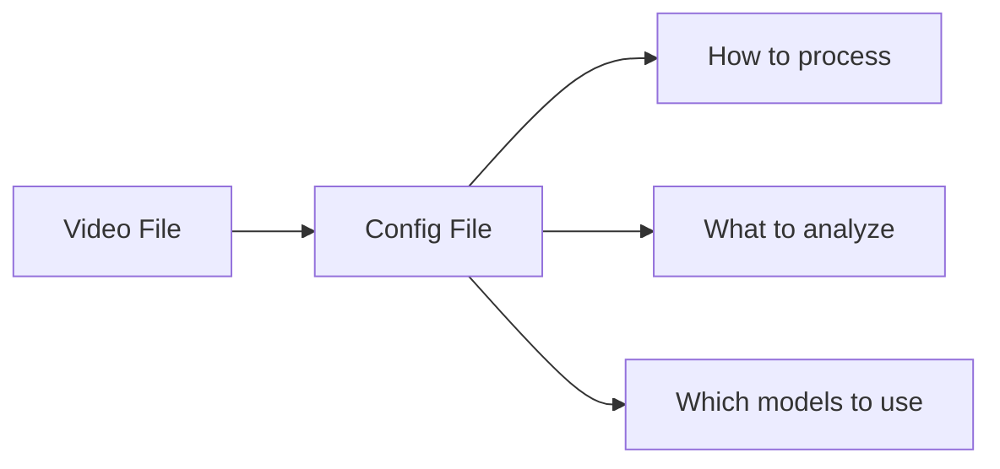

# Understanding Configuration Files

Configuration files control every aspect of how behavysis processes your data. This tutorial explains the structure and all available parameters.

!!! tip "Who is this for?"
    This guide is essential reading before running your first analysis. Understanding configurations will save you time and help avoid reprocessing.

---

## What is a Config File?

Each experiment has its own JSON configuration file in `0_configs/experiment_name.json`. This file stores:

- **Video processing settings** — resolution, frame rate, trimming
- **Analysis parameters** — thresholds, body parts to analyze
- **Model paths** — where to find DeepLabCut and behavior classifier models
- **Calculated values** — automatically detected parameters



---

## Configuration Structure

Every config file has three main sections:

```json
{
  "user": {
    // Your custom settings
  },
  "auto": {
    // Calculated automatically
  },
  "ref": {
    // Reusable references
  }
}
```

### Section 1: `user` — Your Settings

Parameters you define to control processing. This is where you spend most of your time.

### Section 2: `auto` — Auto-Calculated Values

Parameters computed from your data. You typically don't edit these manually.

| Parameter | Description | Example |
|-----------|-------------|---------|
| `start_frame` | First frame with detected animal | `150` |
| `stop_frame` | Last frame of experiment | `27000` |
| `px_per_mm` | Pixel to millimeter conversion | `2.5` |

### Section 3: `ref` — References

Define values once, use them anywhere. Reference with `--` prefix.

---

## Complete Configuration Reference

### `user.format_vid` — Video Formatting

Controls how raw videos are standardized.

```json
{
  "user": {
    "format_vid": {
      "height_px": 540,
      "width_px": 960,
      "fps": 15,
      "start_sec": null,
      "stop_sec": null
    }
  }
}
```

| Parameter | Type | Description | Default |
|-----------|------|-------------|---------|
| `height_px` | integer | Output video height in pixels | `540` |
| `width_px` | integer | Output video width in pixels | `960` |
| `fps` | integer | Output frames per second | `15` |
| `start_sec` | float/null | Start time (seconds) to trim from beginning | `null` |
| `stop_sec` | float/null | End time (seconds) to trim from end | `null` |

!!! example "Use Cases"
    - Set `start_sec: 60` to skip first minute (setup time)
    - Set `fps: 30` for high temporal resolution
    - Set `height_px: 720` for higher quality

---

### `user.run_dlc` — DeepLabCut Configuration

Specifies the pose estimation model.

```json
{
  "user": {
    "run_dlc": {
      "model_fp": "/home/user/dlc_models/my_model/config.yaml"
    }
  }
}
```

| Parameter | Type | Description |
|-----------|------|-------------|
| `model_fp` | string | **Full path** to DeepLabCut model config.yaml |

!!! warning "Critical"
    This must be an absolute path to your DLC model's `config.yaml` file.

---

### `user.calculate_params` — Parameter Calculation

Configures automatic parameter detection.

```json
{
  "user": {
    "calculate_params": {
      "start_frame": {
        "window_sec": 1,
        "pcutoff": 0.9,
        "bodyparts": "--bodyparts-simba"
      },
      "exp_dur": {
        "window_sec": 1,
        "pcutoff": 0.9,
        "bodyparts": "--bodyparts-simba"
      },
      "stop_frame": {
        "dur_sec": 600
      },
      "px_per_mm": {
        "pt_a": "--tl",
        "pt_b": "--tr",
        "dist_mm": 400
      }
    }
  }
}
```

#### `start_frame` — Find When Animal Appears

| Parameter | Type | Description |
|-----------|------|-------------|
| `window_sec` | float | Time window for confidence calculation |
| `pcutoff` | float | Minimum confidence threshold (0-1) |
| `bodyparts` | list/string | Which body parts to use |

#### `stop_frame` — Find When Experiment Ends

| Parameter | Type | Description |
|-----------|------|-------------|
| `dur_sec` | float | Expected experiment duration in seconds |

The actual stop frame is the minimum of: detected end or `start_frame + dur_sec * fps`.

#### `px_per_mm` — Real-World Scale

Converts pixels to millimeters for physical measurements.

| Parameter | Type | Description |
|-----------|------|-------------|
| `pt_a` | string | First corner point name (e.g., "TopLeft") |
| `pt_b` | string | Second corner point name |
| `dist_mm` | float | Real-world distance between points in millimeters |

!!! tip "Arena Setup"
    If your arena is 40cm wide, set `dist_mm: 400` with `pt_a: "TopLeft"` and `pt_b: "TopRight"`.

---

### `user.preprocess` — Data Cleaning

Controls how raw keypoint data is cleaned.

```json
{
  "user": {
    "preprocess": {
      "interpolate": {
        "pcutoff": 0.5
      },
      "refine_ids": {
        "marked": "mouse1marked",
        "unmarked": "mouse2unmarked",
        "marking": "AnimalColourMark",
        "window_sec": 0.5,
        "metric": "rolling",
        "bodyparts": "--bodyparts-centre"
      }
    }
  }
}
```

#### `interpolate` — Fill Missing Data

| Parameter | Type | Description |
|-----------|------|-------------|
| `pcutoff` | float | Confidence threshold below which points are interpolated |

Points with confidence < `pcutoff` are interpolated from neighboring frames.

#### `refine_ids` — Correct Identity Swaps (Multi-Animal)

| Parameter | Type | Description |
|-----------|------|-------------|
| `marked` | string | Name of marked/primary animal |
| `unmarked` | string | Name of unmarked/secondary animal |
| `marking` | string | Body part used for identification |
| `window_sec` | float | Time window for ID assignment |
| `metric` | string | Method: `"rolling"` or `"mean"` |

---

### `user.analyse` — Behavioral Analysis

Controls what analyses are performed.

```json
{
  "user": {
    "analyse": {
      "thigmotaxis": {
        "thresh_mm": 50,
        "roi_top_left": "--tl",
        "roi_top_right": "--tr",
        "roi_bottom_left": "--bl",
        "roi_bottom_right": "--br",
        "bodyparts": "--bodyparts-centre"
      },
      "center_crossing": {
        "thresh_mm": 125,
        "roi_top_left": "--tl",
        "roi_top_right": "--tr",
        "roi_bottom_left": "--bl",
        "roi_bottom_right": "--br",
        "bodyparts": "--bodyparts-centre"
      },
      "in_roi": {
        "thresh_mm": 5,
        "roi_top_left": "--tl",
        "roi_top_right": "--tr",
        "roi_bottom_left": "--bl",
        "roi_bottom_right": "--br",
        "bodyparts": ["Nose"]
      },
      "speed": {
        "smoothing_sec": 1,
        "bodyparts": "--bodyparts-centre"
      },
      "social_distance": {
        "smoothing_sec": 1,
        "bodyparts": "--bodyparts-centre"
      },
      "freezing": {
        "window_sec": 2,
        "thresh_mm": 5,
        "smoothing_sec": 0.2,
        "bodyparts": "--bodyparts-simba"
      },
      "bins_sec": [30, 60, 120, 300],
      "custom_bins_sec": [60, 120, 300, 600]
    }
  }
}
```

#### Analysis Types

##### `thigmotaxis` — Wall-Hugging (Anxiety Measure)

Measures time spent near arena walls.

| Parameter | Type | Description |
|-----------|------|-------------|
| `thresh_mm` | float | Distance from wall to count as "edge" |

!!! note "Interpretation"
    More thigmotaxis = higher anxiety. Typical: 40-60mm threshold.

##### `center_crossing` — Zone Transitions

Counts entries into center zone.

| Parameter | Type | Description |
|-----------|------|-------------|
| `thresh_mm` | float | Center zone boundary distance from edge |

##### `in_roi` — Region of Interest Analysis

Measures time spent in specific region.

| Parameter | Type | Description |
|-----------|------|-------------|
| `thresh_mm` | float | Distance threshold from ROI center |
| `bodyparts` | list | Which body parts to check |

##### `speed` — Movement Velocity

Calculates movement speed over time.

| Parameter | Type | Description |
|-----------|------|-------------|
| `smoothing_sec` | float | Smoothing window in seconds |

##### `social_distance` — Animal Proximity (Multi-Animal)

Measures distance between animals.

| Parameter | Type | Description |
|-----------|------|-------------|
| `smoothing_sec` | float | Smoothing window in seconds |

##### `freezing` — Immobility Detection

Detects freezing behavior (common fear response).

| Parameter | Type | Description |
|-----------|------|-------------|
| `window_sec` | float | Minimum duration to count as freezing |
| `thresh_mm` | float | Movement threshold (below = freezing) |
| `smoothing_sec` | float | Velocity smoothing window |

!!! note "Typical Values"
    - `window_sec: 2` (2 seconds minimum)
    - `thresh_mm: 5` (movement < 5mm considered frozen)

#### Binning

| Parameter | Type | Description |
|-----------|------|-------------|
| `bins_sec` | list | Time bin sizes for analysis (seconds) |
| `custom_bins_sec` | list | Custom bin sizes |

Results are calculated for each bin size: overall summary + time-binned breakdown.

---

### `user.evaluate` — Evaluation Video

Controls annotated video generation for visual validation.

```json
{
  "user": {
    "evaluate": {
      "keypoints_plot": {
        "bodyparts": ["Nose", "BodyCentre", "TailBase1"]
      },
      "eval_vid": {
        "funcs": ["keypoints", "behavs"],
        "pcutoff": 0.5,
        "colour_level": "individuals",
        "radius": 4,
        "cmap": "rainbow"
      }
    }
  }
}
```

---

### `user.extract_features` — Feature Extraction

For machine learning behavior classification.

```json
{
  "user": {
    "extract_features": {
      "individuals": ["mouse1marked", "mouse2unmarked"],
      "bodyparts": "--bodyparts-simba"
    }
  }
}
```

---

### `user.classify_behaviours` — Behavior Classification

List of behavior classifiers to apply.

```json
{
  "user": {
    "classify_behaviours": [
      {
        "model_fp": "/path/to/fight_classifier.json",
        "pcutoff": null,
        "min_window_frames": "--min_window_frames",
        "user_behavs": "--user_behavs"
      }
    ]
  }
}
```

---

## The `ref` Section

Define reusable values to avoid repetition:

```json
{
  "ref": {
    "bodyparts-centre": [
      "BodyCentre",
      "LeftFlankMid",
      "RightFlankMid"
    ],
    "bodyparts-simba": [
      "LeftEar",
      "RightEar",
      "Nose", 
      "BodyCentre",
      "LeftFlankMid",
      "RightFlankMid",
      "TailBase1",
      "TailTip4"
    ],
    "tl": "TopLeft",
    "tr": "TopRight", 
    "bl": "BottomLeft",
    "br": "BottomRight",
    "min_window_frames": 2,
    "user_behavs": ["fight", "aggression"]
  }
}
```

### Referencing Values

Use `--` prefix followed by the key name:

```json
{
  "user": {
    "analyse": {
      "speed": {
        "bodyparts": "--bodyparts-centre"
      }
    }
  },
  "ref": {
    "bodyparts-centre": ["BodyCentre"]
  }
}
```

This resolves to:
```json
{
  "user": {
    "analyse": {
      "speed": {
        "bodyparts": ["BodyCentre"]
      }
    }
  }
}
```

---

## Working with Configs Programmatically

### Read a Config

```python
from behavysis import Project

proj = Project("./my_project")
exp = proj.get_experiment("mouse_A_day1")

# Get config file path
configs_fp = exp.get_fp("0_configs")
print(f"Config: {configs_fp}")
```

### Update Configs for One Experiment

```python
from behavysis.pipeline.experiment import Experiment

exp = Experiment("mouse_A_day1", "./my_project")
exp.update_configs(
    default_configs_fp="./new_config.json",
    overwrite="user"
)
```

### Update Configs for All Experiments

```python
from behavysis import Project

proj = Project("./my_project")
proj.import_experiments()

proj.update_configs(
    default_configs_fp="./default_config.json",
    overwrite="user"
)
```

---

## Starter Template

Here's a minimal working configuration:

```json
{
  "user": {
    "format_vid": {
      "height_px": 540,
      "width_px": 960,
      "fps": 15,
      "start_sec": null,
      "stop_sec": null
    },
    "run_dlc": {
      "model_fp": "/path/to/your/DLC/config.yaml"
    },
    "calculate_params": {
      "start_frame": {
        "window_sec": 1,
        "pcutoff": 0.9,
        "bodyparts": "--bodyparts-simba"
      },
      "stop_frame": {
        "dur_sec": 600
      },
      "px_per_mm": {
        "pt_a": "--tl",
        "pt_b": "--tr",
        "dist_mm": 400
      }
    },
    "preprocess": {
      "interpolate": {
        "pcutoff": 0.5
      }
    },
    "analyse": {
      "thigmotaxis": {
        "thresh_mm": 50,
        "roi_top_left": "--tl",
        "roi_top_right": "--tr", 
        "roi_bottom_left": "--bl",
        "roi_bottom_right": "--br",
        "bodyparts": "--bodyparts-centre"
      },
      "speed": {
        "smoothing_sec": 1,
        "bodyparts": "--bodyparts-centre"
      },
      "bins_sec": [60, 300]
    }
  },
  "ref": {
    "bodyparts-centre": ["BodyCentre"],
    "bodyparts-simba": [
      "Nose", "BodyCentre", "TailBase1"
    ],
    "tl": "TopLeft",
    "tr": "TopRight",
    "bl": "BottomLeft",
    "br": "BottomRight"
  }
}
```

Save this as `default_config.json` and update the DLC model path before using.

---

## Quick Reference Table

| Section | Purpose | Edit? |
|---------|---------|-------|
| `user.format_vid` | Video resizing and FPS | ✓ Yes |
| `user.run_dlc` | DLC model path | ✓ Yes |
| `user.calculate_params` | Auto-detection settings | ✓ Yes |
| `user.preprocess` | Data cleaning | ✓ Yes |
| `user.analyse` | Analysis parameters | ✓ Yes |
| `user.evaluate` | Evaluation video | ✓ Yes |
| `user.extract_features` | ML features | ✓ Yes (if using ML) |
| `user.classify_behaviours` | Behavior classifiers | ✓ Yes (if using ML) |
| `auto` | Calculated values | ✗ No (automatic) |
| `ref` | Reusable values | ✓ Yes |

---

## Next Steps

Now you understand configurations, you're ready to:

- Run your first [Analysis](../examples/analysis.md)
- Train [Behavior Classifiers](../examples/train.md)
- Understand [Diagnostics](diagnostics_messages.md) output