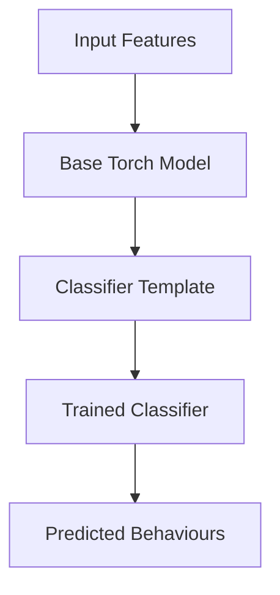

# Behavioural Classifier

This module contains logic and models for behavioural classification, including:

- Model templates (`clf_templates.py`)
- Base model classes (`base_torch_model.py`)
- Main classifier logic (`behaviour_classifier.py`)

## Usage

Import and use the classifier classes to train or predict behaviours. See `train_behaviour_model.py` in `scripts/` for example usage.

